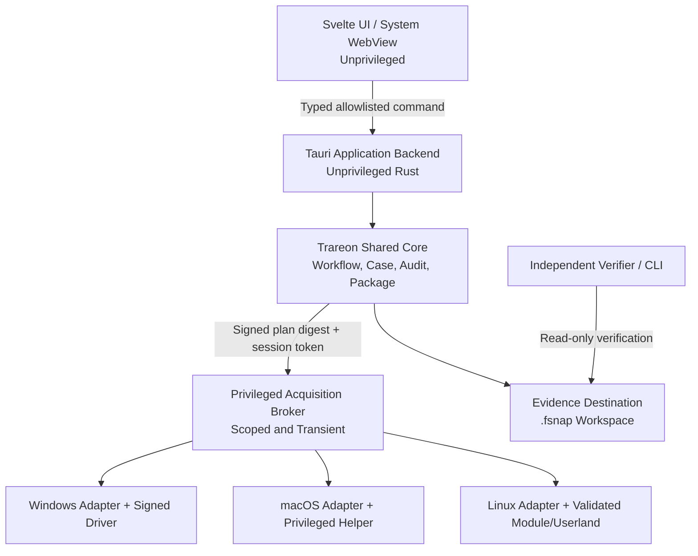

# RFC — Trareon Acquire

## 1. Ringkasan

- **Nama produk:** Trareon Acquire
- **Jenis produk:** Aplikasi desktop portable untuk pengumpulan, akuisisi, verifikasi, dan preservasi barang bukti digital
- **Pembuat dan pemegang hak cipta awal:** Yusuf Shalahuddin Al Ayyubi As Sobari
- **Situs resmi:** `https://trareon.com`
- **Baseline PRD:** `PRD-Digital-Forensic-Acquisition.md` versi 0.3, 16 Juli 2026
- **Status RFC:** Accepted Architectural Baseline v1.0 — dibekukan 17 Juli 2026
- **Change control:** Perubahan normative memerlukan ADR/RFC amendment, traceability update, dan validation-impact review
- **Implementation roadmap:** `docs/IMPLEMENTATION-ROADMAP.md`
- **Foundation plan:** `docs/superpowers/plans/2026-07-17-trareon-acquire-foundation.md`
- **Zero-cash launch plan:** `docs/ZERO-CASH-LAUNCH-PLAN.md`
- **Target OS:** Windows, macOS, Linux
- **Runtime:** Tauri 2
- **Shared core:** Rust
- **Frontend:** Svelte 5, TypeScript, dan Vite
- **Lisensi source code:** Mozilla Public License 2.0 (MPL-2.0)
- **Mode distribusi:** Source code terbuka; official signed build dapat dijual terpisah
- **Konektivitas:** Full offline; default-deny untuk koneksi outbound

Trareon Acquire menggunakan satu shared core untuk workflow, hashing, manifest, audit, chain of custody, validation, reporting, dan evidence package. Operasi yang memerlukan raw-device atau kernel access dilakukan oleh privileged acquisition broker dan adapter native per OS. UI dan proses utama tidak pernah dijalankan sepenuhnya sebagai Administrator atau root.

RFC ini menetapkan arsitektur yang dapat bertahan untuk aplikasi pendamping Trareon Analysis di masa depan tanpa mencampur acquisition dengan examination atau analysis.

### 1.1 Prinsip yang tidak boleh dilanggar

Urutan prioritas produk adalah:

1. Validitas, reproducibility, dan defensibility.
2. Keselamatan serta integritas source.
3. Completeness dan transparansi coverage.
4. Interoperability dan preservasi jangka panjang.
5. Performa.
6. Kemudahan penggunaan.
7. Luas fitur.

Optimasi, kemudahan, atau target komersial tidak boleh mengurangi empat prioritas pertama.

### 1.2 Terminologi klaim

Produk boleh menyatakan bahwa implementasi:

- selaras dengan atau mendukung workflow ISO/IEC yang disebutkan;
- telah lulus test tertentu pada kombinasi build, OS, hardware, dan konfigurasi tertentu;
- menghasilkan record untuk membantu quality management.

Produk tidak boleh menyatakan bahwa:

- penggunaan aplikasi otomatis membuat pengguna compliant atau terakreditasi;
- semua bukti selalu berhasil diperoleh;
- output otomatis diterima di semua pengadilan atau yurisdiksi;
- hash saja membuktikan acquisition lengkap;
- build komunitas mewarisi validation status official build.

## 2. Problem Statement

Tool acquisition yang ada sering memisahkan disk imaging, RAM capture, network capture, targeted collection, case metadata, chain of custody, validation, dan reporting. Fragmentasi menyebabkan identifier, waktu, parameter, error, serta provenance tidak konsisten. Sebagian tool juga menyederhanakan status menjadi berhasil/gagal tanpa menjelaskan coverage, limitation, atau perubahan pada live source.

Trareon Acquire harus menyelesaikan masalah tersebut tanpa menjadi analysis suite, tanpa bergantung pada internet, dan tanpa mengharuskan runtime atau tool pihak ketiga sudah terpasang pada target.

### 2.1 Mengapa solusi ini dipilih

Tauri 2 digunakan sebagai shell desktop yang kecil dan lintas platform. Rust digunakan untuk shared core karena memory safety, kontrol I/O, performa, dan kemudahan menghasilkan library serta CLI dari implementasi yang sama. Svelte menghasilkan UI compiled dengan runtime ringan. Adapter native tetap diperlukan karena raw disk, RAM, network capture, privilege, driver, dan platform security berbeda pada setiap OS.

Arsitektur ini tidak menganggap Tauri WebView sebagai boundary forensik tepercaya. WebView hanya menampilkan state dan meminta command. Seluruh otorisasi, validasi, state transition, file access, dan device access dilakukan kembali di Rust.

## 3. Goals

1. Menyediakan workflow ISO/IEC 27037 dari identification sampai preservation.
2. Menyatukan disk, volume, RAM, volatile state, network, dan targeted collection dalam satu case model.
3. Menghasilkan evidence package terbuka yang dapat diverifikasi tanpa aplikasi utama.
4. Menolak silent fallback, silent truncation, dan status lengkap yang tidak benar.
5. Beroperasi penuh secara offline dan portable.
6. Menjalankan jalur data acquisition di Rust tanpa melewati WebView.
7. Memisahkan privilege sehingga UI tidak memiliki akses raw-device.
8. Merekam expected dan observed tool footprint pada live source.
9. Menyediakan validation evidence per method/platform combination.
10. Mempertahankan kompatibilitas package dan verifier untuk kasus lama.
11. Menyediakan guided workflow untuk pemula tanpa mengurangi kontrol integrity.
12. Memungkinkan source build gratis dan official verified build berbayar.

## 4. Non-Goals

- Examination, indexing, keyword search, carving, deleted-file recovery, atau timeline analysis.
- Malware verdict, attribution, content classification, atau legal conclusion.
- Password cracking, credential extraction, atau security bypass.
- Arbitrary plugin atau executable yang tidak divalidasi.
- Mobile, cloud, atau remote fleet acquisition pada MVP.
- Long-term evidence management repository.
- Jaminan bahwa seluruh evidence selalu dapat diperoleh.
- Menulis ulang primitive kriptografi, compression, atau format kompleks tanpa alasan keamanan, lisensi, atau validasi yang terukur.
- Online activation, telemetry, background update, cloud sync, atau remote kill switch.

System Snapshot diff dan deterministic explainable risk indicator tetap menjadi pengecualian terbatas sebagaimana disetujui PRD.

## 5. Keputusan Arsitektur

### 5.1 Stack utama

| Area | Keputusan |
|---|---|
| Desktop shell | Tauri 2 |
| Frontend | Svelte 5 + TypeScript + Vite |
| Shared core | Rust stable edition yang dipin per release |
| Async runtime | Tokio, hanya pada boundary yang membutuhkan concurrency |
| Workspace database | SQLite terbundel melalui Rust; bukan bagian evidence master |
| Serialization | JSON terdokumentasi; canonical JSON untuk objek yang ditandatangani; MessagePack untuk System Snapshot |
| Audit stream | Append-only JSON Lines dengan hash chain |
| Report | HTML mandiri dan PDF/A; JSON/CSV untuk machine-readable export |
| Baseline hash | SHA-256 |
| Package signature | Algorithm-agile detached signature; profile awal ditetapkan dalam crypto specification |
| Network capture | PCAPNG |
| Storage image P0 | RAW/dd dan split-dd |
| Storage image P1 | E01/EWF, Ex01/EWF2, AFF4 setelah conformance test |
| Source license | MPL-2.0 |

### 5.2 Hermetic hybrid

Semua runtime dependency harus:

- di-static-link bila aman dan kompatibel;
- atau dibundel sebagai library/helper/driver di dalam official package;
- dipin source dan versinya;
- memiliki hash, license, provenance, dan validation coverage;
- tidak diunduh pada startup atau saat acquisition;
- tidak dicari dari PATH atau installation target;
- dapat diganti hanya melalui signed offline update.

Library matang digunakan untuk crypto, compression, EWF/AFF4, PCAPNG, SQLite, dan format lain. Workflow, audit, coverage, acquisition coordination, package schema, validation gating, serta adapter contract dimiliki Trareon.

### 5.3 Build identity

Setiap binary dan output menyimpan:

- semantic version;
- immutable build ID;
- source revision;
- dirty-tree flag;
- toolchain dan target triple;
- enabled feature flags;
- dependency lock digest;
- SBOM digest;
- signing identity;
- capability matrix version;
- validation pack version.

## 6. Arsitektur Tingkat Tinggi



### 6.1 Trust boundary

| Boundary | Trust level | Aturan |
|---|---|---|
| UI/WebView | Tidak tepercaya untuk keputusan keamanan | Tidak boleh mengakses raw path/device langsung |
| Tauri command layer | Mediasi | Command allowlist, typed input, size limit, state validation |
| Shared core | Tepercaya tetapi tetap defensif | Authoritative state, policy, audit, package, hashing |
| Acquisition broker | Sangat tepercaya | Surface minimal, scope per plan, lifetime terbatas |
| Driver/native module | Paling kritis | Signed, version-pinned, validation-gated, audited |
| Source device | Tidak tepercaya | Data, metadata, filesystem, dan utility output dapat berbahaya/palsu |
| Evidence destination | Tidak tepercaya sampai diuji | Preflight, capacity, durability, path, and identity checks |
| Evidence package input | Tidak tepercaya | Parser bounded, no execution, no path traversal |

### 6.2 Privilege model

- Main UI dan Tauri backend berjalan sebagai user normal.
- Setiap privileged operation membutuhkan acquisition plan yang sudah difinalisasi.
- Broker menerima hanya operation ID, source identity, allowed ranges/paths, destination handle, limits, dan plan digest.
- Broker tidak menerima arbitrary shell command.
- IPC memakai OS ACL, per-session random token, nonce, request ID, replay protection, dan executable identity check.
- Helper berhenti setelah job selesai atau timeout.
- Driver/helper load, unload, cleanup, dan sisa perubahan masuk audit.
- Cancel privilege prompt tidak mengubah plan menjadi metode yang lebih lemah secara diam-diam.

## 7. Struktur Workspace dan Komponen

Struktur awal repository:

```text
apps/
  acquire-desktop/        # Tauri + Svelte application
  verifier-cli/           # portable independent verifier
  acquisition-cli/        # headless runner using shared core
crates/
  domain/                 # IDs, entities, states, invariant
  workflow/               # case and acquisition state machines
  audit/                  # append-only hash-chained events
  manifest/               # canonical manifest and signatures
  fsnap/                  # directory/archive package handling
  imaging/                # read-hash-write-coverage pipeline
  targeted/               # signed collection profile engine
  snapshot/               # system snapshot, diff, rules
  validation/             # self-test and method qualification
  reporting/              # HTML/PDF-A/JSON/CSV models
  platform-contract/      # adapter traits and capability types
  adapter-windows/
  adapter-macos/
  adapter-linux/
  privileged-protocol/    # authenticated broker protocol
native/
  windows-driver/
  macos-helper/
  linux-helper/
schemas/
  fsnap/
  audit/
  snapshot/
profiles/
  collection/
  compliance/
  language/
validation/
  fixtures/
  expected/
  matrices/
docs/
  user/
  field/
  technical/
  validation/
  security/
```

Komponen harus memiliki satu tanggung jawab dan public contract. Adapter tidak boleh memuat workflow bisnis; UI tidak boleh membuat final status; reporter tidak boleh menghitung ulang fakta acquisition.

## 8. Model Domain

### 8.1 Entitas utama

| Entitas | Tanggung jawab |
|---|---|
| `Case` | Metadata, authorization, scope, status, examiner, lifecycle |
| `EvidenceSource` | Identitas perangkat/source dan kondisi awal |
| `EvidenceItem` | Item fisik/logis, label, seal, custody relationship |
| `AcquisitionPlan` | Source, destination, method, scope, settings, risks |
| `PreflightResult` | Capability, privilege, capacity, safety, readiness |
| `AcquisitionJob` | State, progress, checkpoints, warnings, result |
| `CoverageMap` | Range/item acquired, unreadable, skipped, padded, unavailable |
| `EvidenceGap` | Semua area atau artefak yang tidak diperoleh beserta alasan |
| `ArtifactRecord` | Payload, metadata, provenance, preservation status |
| `CustodyEvent` | Actor, transfer, time, purpose, condition, acknowledgement |
| `AuditEvent` | Immutable event envelope dan hash-chain link |
| `ValidationRecord` | Method/platform qualification dan evidence test |
| `CapabilityRecord` | Supported/conditional/unsupported state dan limitation |
| `ToolFootprint` | Expected serta observed change dari aplikasi/helper |
| `PackageManifest` | Inventory final dan relationship seluruh object |
| `DerivedObject` | Working copy, diff, re-score, export, atau migration lineage |

### 8.2 Identifier

- Internal ID menggunakan UUIDv7 agar unik dan time-sortable.
- Organization-provided Case ID disimpan terpisah dan tidak digunakan sebagai primary key.
- Evidence ID default `TR-EV-YYYYMMDD-NNNN`, dapat dikonfigurasi tanpa mengubah internal ID.
- Acquisition, job, snapshot, custody, audit, dan package memiliki ID sendiri.
- ID tidak pernah didaur ulang.

### 8.3 Waktu

Setiap event kritis menyimpan:

- UTC timestamp;
- local timestamp dan IANA timezone;
- monotonic sequence/counter;
- clock source;
- measured offset dan confidence bila tersedia;
- boot/session ID;
- actor atau automatic basis.

Perubahan clock tidak mengurutkan ulang audit. Monotonic sequence menjadi urutan internal, sedangkan wall-clock tetap dilaporkan apa adanya.

### 8.4 State machine

Case:

```text
Draft -> Identified -> Planned -> Acquiring -> Verifying -> Finalized -> Closed -> Archived
```

Acquisition job:

```text
Draft -> PreflightPassed -> Authorized -> Running
Running -> PausedAtCheckpoint -> Running
Running -> Verifying -> VerifiedComplete | VerifiedPartial | CompletedUnverified
Running -> ResumableInterrupted | Aborted | Failed
```

Tidak ada transition langsung dari `Running` ke `VerifiedComplete`. Verification dan coverage evaluation wajib selesai terlebih dahulu.

### 8.5 Persistence

- SQLite menyimpan draft workspace dan UI projection.
- SQLite memakai foreign keys, transactional migration, integrity check, dan bounded WAL.
- Audit event ditulis ke append-only journal terpisah sebelum UI menerima acknowledgement.
- Payload evidence tidak disimpan sebagai SQLite BLOB.
- Finalization membuat canonical manifest dari domain state, bukan menyalin state UI.
- Evidence package tidak dimigrasi in-place; migrasi membuat derived package dengan lineage.

## 9. Evidence Package `.fsnap`

### 9.1 Bentuk paket

Primary working form adalah direktori bernama `*.fsnap/`. Single-file transfer form menggunakan ZIP64 streaming dengan extension `.fsnap`, deterministic entry naming, dan tanpa menjalankan isi package. Archive bersifat export; directory master tidak harus diduplikasi bila operator tidak membutuhkannya.

```text
case-2026-0001.fsnap/
  fsnap.json
  manifest/
    manifest.json
    manifest.sig
    sbom.spdx.json
  audit/
    events.jsonl
    checkpoints/
  custody/
    events.jsonl
    signatures/
  sources/
    <source-id>/source.json
  acquisitions/
    <acquisition-id>/
      plan.json
      preflight.json
      result.json
      coverage.json
      gaps.json
      footprint.json
      checkpoints/
  payload/
    images/
    memory/
    network/
    targeted/
    snapshots/
  reports/
    acquisition.html
    acquisition.pdf
  attachments/
  validation/
```

### 9.2 Manifest rules

- Setiap file terdaftar dengan normalized relative path, size, content type, hash algorithm, digest, provenance, dan status.
- Absolute path, `..`, symlink keluar package, device path, dan reserved-name escape dilarang.
- Canonical manifest tidak bergantung pada filesystem enumeration order.
- File tambahan, hilang, berubah, duplicate path, case-fold collision, dan Unicode normalization collision dilaporkan verifier.
- Signature detached mengikat manifest root, audit root, schema version, build identity, dan finalization time.
- Hash plaintext dan ciphertext tidak boleh diberi label ambigu bila encryption ditambahkan.

### 9.3 Audit continuity

Setiap `AuditEvent` memiliki:

- event ID dan sequence;
- previous event hash;
- canonical event hash;
- timestamp record;
- actor;
- action;
- target ID;
- before/after reference bila relevan;
- rationale atau automatic basis;
- build/session identity.

Checkpoint signature dibuat pada boundary kritis dan final signature dibuat saat finalization. Audit journal tidak diklaim immutable sebelum finalization; perubahan atau discontinuity harus terdeteksi.

### 9.4 Independent verifier

Verifier:

- read-only dan tanpa raw-device privilege;
- tidak memakai database workspace;
- memverifikasi schema, path safety, manifest, signature, hashes, audit chain, custody chain, coverage, gaps, dan lineage;
- tersedia sebagai GUI minimal dan CLI;
- menghasilkan exit code stabil serta report JSON/HTML;
- tidak membuka atau menginterpretasikan isi evidence payload;
- dapat memverifikasi package lama menurut compatibility policy.

### 9.5 Encryption decision

Evidence-package encryption tidak wajib pada MVP karena key custody, recovery, interoperability, dan validation perlu profil tersendiri. MVP mewajibkan warning destination dan mendukung penyimpanan pada media yang dienkripsi organisasi.

Schema sejak versi pertama menyediakan encryption envelope metadata. P1 dapat menambahkan algorithm-agile envelope encryption setelah threat model, recovery procedure, independent implementation, dan interoperability test lulus. Encryption tidak boleh menghalangi verifikasi provenance atau membuat kehilangan key terlihat sebagai corruption.

## 10. Acquisition Pipeline

### 10.1 Jalur panas

```text
validated source handle
  -> aligned bounded read
  -> streaming SHA-256
  -> optional validated compression
  -> segmented destination write
  -> flush/durability boundary
  -> coverage and checkpoint journal
```

WebView, SQLite, report generation, dan PDF rendering tidak berada di jalur panas.

### 10.2 Performa dan backpressure

- Buffer pool memiliki batas eksplisit dan tidak tumbuh mengikuti source size.
- Read dan write concurrency dibatasi berdasarkan adapter serta destination.
- Hash dihitung streaming dalam pass acquisition.
- Post-acquisition verification membaca output secara independen.
- Block size dipilih dari validated profile; perubahan manual dicatat sebagai deviation.
- UI menerima throttled progress event maksimum sesuai interval, bukan event per block.
- Resource governor dapat menurunkan concurrency tetapi tidak boleh mengubah hash, error policy, atau coverage semantics.
- Target sehat: minimal 80% sequential-read baseline dengan SHA-256 aktif pada reference hardware.

### 10.3 Bad sector dan inconsistent read

- Retry count, timeout, direction, block-size reduction, padding, dan skip policy eksplisit.
- Setiap attempt dicatat tanpa membanjiri audit utama; detail tersedia pada error map.
- Padding tidak dihitung sebagai byte source yang berhasil dibaca.
- Re-read sampling dapat mendeteksi inconsistent source, tetapi tidak menggantikan full verification.
- Hidden atau not-addressable range masuk `EvidenceGap`, bukan dianggap zero-filled evidence.

### 10.4 Checkpoint dan resume

Checkpoint menyimpan:

- source composite identity;
- destination identity;
- plan digest;
- last durable segment;
- segment hash;
- coverage root;
- build/method identity;
- monotonic checkpoint number;
- signed resume token.

Resume menolak source, destination, plan, segment, atau build compatibility yang tidak cocok. Cross-workstation resume adalah P1 dan hanya diizinkan bila signature serta seluruh identity cocok. Ketidakcocokan membuat job/lineage baru.

### 10.5 Live consistency

Hasil live acquisition memperoleh salah satu label:

- `Static Source Verified`
- `Snapshot-Backed Consistent`
- `Crash-Consistent`
- `Live Source — Change Observed`
- `Application Consistency Unknown`
- `Verified Partial`

Label berasal dari fakta metode, bukan pilihan naratif operator. Hash tidak boleh digunakan untuk menyatakan live source tidak berubah.

## 11. Preflight dan Keselamatan

### 11.1 Acquisition Readiness Certificate

Preflight menghasilkan record bertanda tangan berisi:

- source dan destination identity;
- capability dan validation status;
- privilege/helper/driver readiness;
- write-protection status;
- capacity, filesystem, maximum file size, free-space margin;
- controlled destination scratch-test result;
- estimated size, time, power, dan thermal risk;
- method, hash, compression, segmentation, error policy;
- expected source change;
- evidence gaps yang sudah diketahui;
- warnings, override, dan actor approval.

Record ini menjadi bagian package dan dapat diekspor sebelum acquisition.

### 11.2 Source identity

Composite identity dapat menggunakan serial, WWN, model, firmware, capacity, sector geometry, bus/controller, physical port path, partition-table fingerprint, serta read-only sample fingerprint. Missing atau duplicate identifier dilaporkan.

Sebelum acquisition dimulai, pengguna mengonfirmasi source dan destination melalui atribut fisik yang berbeda, bukan hanya `Disk 0` atau drive letter.

### 11.3 Destination qualification

Scratch test hanya dilakukan pada destination dan memakai file bernama unik. Test memeriksa write/read/flush, throughput, filesystem limit, capacity margin, reconnect behavior bila didukung, dan cloud-sync indication. Scratch artifact dihapus dan cleanup dicatat.

Destination pada source volume ditolak. Override hanya tersedia untuk skenario tervalidasi dan tidak boleh menjadi default.

### 11.4 Evidence Gap Register

Semua limitation dikonsolidasikan dalam satu register, termasuk unreadable ranges, skipped item, hidden area, unavailable RAM, unpreserved metadata, access denied, unsupported capability, legal-scope exclusion, dropped packet, serta operator exclusion.

Finalization tidak boleh menyembunyikan gap. Report ringkas menampilkan gap sebelum status keberhasilan.

### 11.5 Tool Footprint Manifest

Setiap build membawa expected footprint untuk process, driver, service, temporary file, registry/config entry, mount, socket, cache, dan cleanup behavior. Sesi live membandingkan expected dengan observed footprint sejauh metode memungkinkan.

Unknown observed change tidak otomatis dianggap berasal dari target atau tool; statusnya `Unattributed Change` sampai dijelaskan.

## 12. Adapter Platform

### 12.1 Contract umum

Setiap adapter mengimplementasikan:

- capability discovery;
- source enumeration dan composite identity;
- privilege requirements;
- raw/logical read contract;
- snapshot and targeted metadata contract;
- write-protection observation;
- footprint declaration;
- cleanup;
- structured error mapping;
- validation fingerprint.

Adapter tidak menentukan final acquisition status.

### 12.2 Windows

- UI menggunakan user token biasa.
- UAC hanya digunakan untuk broker/helper yang membutuhkan privilege.
- Kernel driver harus production-signed melalui jalur Microsoft yang berlaku.
- Driver load/unload bersifat transient dan dicatat.
- BitLocker, TPM, VSS/snapshot, HVCI, Secure Boot, dan security-control state dicatat.
- Tidak mengaktifkan test-signing, menonaktifkan Secure Boot, atau mengubah security policy pada evidence target sebagai fallback.
- Unsupported driver/security state menghasilkan safe refusal dan volatile-state fallback bila tersedia.

### 12.3 macOS

- Main app menggunakan Developer ID signing dan notarization untuk official build.
- Privileged helper memakai OS-native authorization dan requirement yang mengikat helper ke designated app identity.
- FileVault, Apple Silicon/T2, APFS snapshot, SIP, Full Disk Access, Gatekeeper, serta security state dicatat.
- Tidak meminta reboot untuk memperoleh RAM yang akan hilang akibat reboot.
- Full RAM hanya ditawarkan pada combination yang memiliki metode tervalidasi.
- Dead-box Apple Silicon berada di luar MVP sampai metode tervalidasi tersedia.

### 12.4 Linux

- Broker menggunakan OS-native privilege elevation atau boot environment.
- Adapter mendeteksi distro, kernel, module ABI, Secure Boot, lockdown, LSM, filesystem, dan architecture.
- Module hanya dimuat bila build dan kernel combination tervalidasi.
- Tidak mematikan Secure Boot/kernel lockdown secara otomatis.
- Linux x86_64 adalah P0; ARM64 P1.

### 12.5 Forensic boot environment

Boot environment menggunakan shared core, schema, profiles, dan verifier yang sama. Source default read-only; tidak ada auto-acquisition saat boot. Image boot ditandatangani, dibangun reproducibly sejauh praktis, dan memiliki capability matrix sendiri.

## 13. Targeted Collection dan System Snapshot

### 13.1 Collection profile

Profile adalah data deklaratif bertanda tangan, bukan executable. Profile menentukan sources, includes, excludes, metadata, locked-file strategy, expected changes, legal-scope fields, limitation, version, dan validation status.

Quick, Standard, Deep, dan Custom adalah scope preset; label tidak menyatakan completeness. Preview menunjukkan estimasi, included sources, exclusions, dan expected footprint.

### 13.2 Scope enforcement

- Path, user, volume, timeframe, dan category divalidasi terhadap authorization scope.
- Profile tidak boleh memperluas scope diam-diam.
- Symbolic link, reparse point, mount crossing, alternate stream, hard link, dan case-insensitive collision memiliki policy eksplisit.
- Item yang berubah selama collection dicatat.
- Tidak ada content interpretation di acquisition core.

### 13.3 System Snapshot

Snapshot menyimpan host identity, OS/build/kernel, clocks, filesystem inventory, process/service, user session, network state, route, neighbor, dan mount. Diff mempertahankan dua snapshot asli dan menghasilkan derived object.

Risk indicator:

- deterministic;
- berasal dari signed versioned rule pack;
- menunjukkan exact fact dan rule;
- reproducible lintas build yang kompatibel;
- tidak menggunakan AI/LLM;
- tidak menyatakan malware verdict atau attribution.

## 14. IPC, API, dan Error Contract

### 14.1 Tauri command boundary

Command dikelompokkan per capability:

- `case.read`, `case.write`
- `identify.enumerate`
- `plan.create`, `plan.finalize`
- `acquisition.start`, `acquisition.pause`, `acquisition.cancel`
- `verification.run`
- `package.finalize`, `package.export`
- `validation.run`
- `documentation.open`

Tidak ada `run_shell`, arbitrary SQL, arbitrary filesystem read/write, atau raw-device command dari frontend.

### 14.2 Input validation

- Semua request memakai versioned typed DTO.
- Unknown security-sensitive field ditolak.
- String, list, file, dan payload memiliki batas ukuran.
- Path dipilih melalui Rust/native dialog lalu dikembalikan sebagai opaque handle bila memungkinkan.
- Device ID diselesaikan ulang oleh adapter sebelum start.
- Frontend-provided final status, hash, capability, privilege, atau validation state diabaikan.

### 14.3 Error envelope

```json
{
  "code": "DESTINATION_SPACE_INSUFFICIENT",
  "category": "preflight",
  "severity": "blocking",
  "operation_id": "uuid",
  "safe_message_key": "error.destination.space_insufficient",
  "technical_detail": {},
  "consequence": "Acquisition tidak dimulai",
  "next_safe_actions": ["select_other_destination"],
  "retryable": false,
  "audit_event_id": "uuid"
}
```

UI menerjemahkan `safe_message_key`; code dan semantics tidak berubah antar bahasa. Error sensitif tidak ditampilkan pada desktop notification.

### 14.4 Idempotency

Command mutating memakai operation ID. Retry dengan ID sama tidak boleh menggandakan case, event, output segment, custody transfer, atau finalization.

## 15. Failure Handling

### 15.1 Prinsip umum

- Failure tidak pernah diubah menjadi success hanya untuk menyelesaikan workflow.
- Output parsial dipertahankan, diberi status, dan dapat diverifikasi sejauh byte yang tersedia.
- Error selalu menyebut consequence serta next safe action.
- Cleanup failure tidak menghapus error acquisition yang lebih awal.
- UI crash tidak menghentikan broker secara tidak terkendali; broker mengikuti policy plan dan checkpoint.
- Broker crash tidak membuat UI menganggap job selesai.

### 15.2 Crash dan restart

- Domain transaction dan audit event memiliki write ordering yang terdokumentasi.
- Pada startup, recovery scanner mencari incomplete transaction, orphan staging file, running broker, dan unfinalized package.
- Recovery tidak menulis ke source.
- Job kembali sebagai `ResumableInterrupted`, `Failed`, atau `RecoveryRequired`; tidak pernah `VerifiedComplete`.
- Recovery decision dan perubahan state dicatat.

### 15.3 Destination disconnect/full

- Writer berhenti pada safe boundary dan mencoba flush bila device masih tersedia.
- Segment yang belum durable tidak dianggap acquired.
- Reconnect diverifikasi melalui destination identity, bukan mount path saja.
- Destination baru menghasilkan derived continuation atau controlled multi-destination lineage; tidak menyamar sebagai file yang sama.

### 15.4 Source disconnect/change

- Reconnect memerlukan composite identity match.
- Capacity, geometry, partition fingerprint, dan sample fingerprint dibandingkan kembali.
- Identity mismatch menutup job dan meminta plan baru.
- Live source change menghasilkan consistency warning dan tidak otomatis gagal bila metode memang live; perubahan tetap dicatat.

### 15.5 Cancel dan emergency stop

- Normal cancel menunggu checkpoint aman.
- Emergency stop tersedia untuk risiko keselamatan fisik, thermal, power, atau device damage.
- Emergency stop dapat meninggalkan segment belum final tetapi wajib membuat audit marker.
- Cancel satu job tidak membatalkan job lain pada controlled parallel mode.

### 15.6 Storage corrupt

- Workspace SQLite menjalankan integrity check dan mempertahankan journal recovery.
- Manifest/package verification tidak bergantung pada SQLite.
- Corrupt package tidak diperbaiki in-place.
- Salvage hanya membuat derived package dan report mengenai object yang berhasil/tidak berhasil diselamatkan.

## 16. UX dan Guided Operation

### 16.1 Satu engine, empat pengalaman

| Mode | Pengguna | Perbedaan UI | Kontrol yang tidak berubah |
|---|---|---|---|
| Guided | Pemula/first responder | Wizard, bahasa ringkas, rekomendasi | Scope, preflight, audit, hash, coverage, verification |
| Standard | Investigator/DFIR | Workflow utama dan parameter umum | Seluruh integrity gates |
| Expert | Examiner/lab | Raw parameters, diagnostics, rule detail | Tidak dapat mematikan invariant inti |
| Training | Semua | Source sintetis/simulasi | Tidak mengakses raw device nyata tanpa perpindahan mode eksplisit |

Mode adalah presentation preference, bukan role yang mengubah fakta evidence. Emergency override tetap membutuhkan alasan dan tidak disembunyikan oleh Guided Mode.

### 16.2 Navigasi

Urutan utama:

```text
Case -> Identify -> Collect -> Plan -> Preflight -> Acquire -> Verify -> Package -> Transfer
```

Header persisten menampilkan Case ID, Evidence ID, source, destination, privilege, write-protection, capability, validation state, job status, dan unresolved gaps.

### 16.3 Context help

Setiap feature dan keputusan kritis memiliki bantuan lokal:

- apa yang dilakukan;
- mengapa diperlukan;
- data yang diperoleh;
- privilege yang diminta;
- expected source changes;
- limitation;
- output yang dihasilkan;
- standard/practice mapping;
- contoh keputusan;
- next safe action.

Help dibundel, dapat dicari offline, version-matched dengan aplikasi, dan tidak mengambil konten web.

### 16.4 Dangerous action

Destructive atau high-risk confirmation:

- modal dan tidak tersembunyi;
- menyebut source/destination dengan composite identity;
- menjelaskan dampak;
- tidak memakai default affirmative button;
- membutuhkan typed confirmation untuk boot-media write atau dangerous override;
- optional four-eyes approval pada organization profile;
- tidak dapat dipicu single-key shortcut.

### 16.5 Accessibility dan bahasa

- Bahasa Indonesia dan Inggris tersedia penuh pada release pertama.
- Language pack lain berupa signed offline data pack.
- Translation key tidak mengubah error code atau forensic term ID.
- WCAG 2.2 AA diterapkan pada komponen relevan.
- Keyboard-only, screen reader, 100–200% scaling, dan status non-color-only wajib.
- Terminologi teknis memiliki ringkas/detail tanpa menyembunyikan limitation.

## 17. Dokumentasi

Dokumentasi adalah release artifact dan memiliki version yang sama dengan build.

### 17.1 Set dokumen

1. Quick Start Guide.
2. Field Operations Guide.
3. Complete User Manual.
4. Examiner Technical Reference.
5. Administrator and Deployment Guide.
6. Validation Handbook.
7. Platform Capability and Limitation Guide.
8. `.fsnap` Evidence Package Specification.
9. Independent Verifier Guide.
10. CLI and Automation Reference.
11. Security Architecture and Threat Model.
12. Chain of Custody and Reporting Guide.
13. Troubleshooting and Recovery Manual.
14. Developer and Contributor Guide.
15. Release Qualification Pack.

### 17.2 Format dan distribusi

- Source documentation menggunakan Markdown/docs-as-code.
- HTML mandiri dibundel di aplikasi.
- Field guide dan dokumen formal diekspor ke PDF/A.
- Schema dan contoh tersedia sebagai JSON Schema serta sample package.
- Tidak ada dokumentasi wajib yang membutuhkan internet.
- Dokumentasi versi lama tetap tersedia bersama release provenance.

### 17.3 Anti-drift controls

- Setiap public feature/command/error memiliki documentation ID.
- CI gagal bila feature publik tidak memiliki documentation mapping.
- Screenshot diuji ulang ketika UI layout berubah.
- Code examples pada CLI guide dijalankan sebagai documentation tests.
- Requirement ID dipetakan ke design section, test, dan documentation.
- Help bundle memiliki hash dan signature di release manifest.

## 18. Security Architecture

### 18.1 Threats utama

- Frontend compromise/XSS mencoba memanggil privileged command.
- Malicious source filesystem/path/metadata menyerang parser.
- Source utility memberikan output palsu karena malware/anti-forensics.
- Source/destination reversal.
- Privileged helper hijack atau IPC replay.
- Tampered driver/profile/rule/update.
- Path traversal atau archive bomb pada `.fsnap`.
- Dependency/build pipeline compromise.
- Signing key compromise.
- Sensitive case data bocor melalui logs, crash dump, clipboard, notification, atau WebView cache.
- Malicious fork mengaku sebagai official build.

### 18.2 Controls

- Strict CSP; tidak ada remote content, CDN, atau runtime script download.
- Tauri capability per window/platform dengan explicit allowlist.
- No shell plugin dan no broad filesystem permission di frontend.
- Rust revalidation pada setiap command.
- Privileged broker dengan authenticated IPC dan minimal command surface.
- Source data selalu dianggap tidak tepercaya.
- Parser fuzzing, input limits, archive limits, dan path normalization.
- Signed modules/profiles/rules/updates.
- Reproducible-build comparison dan SLSA-style provenance.
- SPDX SBOM dan dependency admission review.
- Offline root signing key dan separated intermediate keys.
- Security contact serta coordinated disclosure.

### 18.3 Memory-safety registry

Seluruh `unsafe`, FFI, native library, driver, dan memory-unsafe dependency masuk registry yang memuat owner, alasan, invariant, tests, sanitizer/fuzzing status, dan replacement roadmap. Raw pointer tidak boleh menembus domain/workflow layer.

### 18.4 Key lifecycle

Key dipisahkan untuk:

- source/release tag attestation;
- application binary;
- Windows driver submission;
- macOS Developer ID/notarization;
- offline update bundle;
- profile/rule/language pack;
- evidence-package signer milik organisasi pengguna.

Release production membutuhkan two-person approval. RFC implementasi kriptografi terpisah harus menetapkan generation, storage, backup, rotation, expiration, revocation, compromise response, dan offline trust-store update.

### 18.5 Privacy

- Tidak ada telemetry atau automatic crash upload.
- Crash report lokal melakukan redaction dan opt-in export.
- Notification tidak memuat nama kasus/path/evidence.
- Clipboard tidak digunakan untuk secret atau raw key.
- WebView cache dan recent-file integration diminimalkan.
- Secure deletion hanya diklaim bila media/method mendukung; SSD tidak diberi klaim palsu.

## 19. Supply Chain dan Dependency Policy

Dependency baru harus memiliki:

- fungsi yang jelas dan tidak mudah/aman untuk diimplementasikan sendiri;
- license kompatibel;
- maintainer/release provenance yang dapat diperiksa;
- pinned version/source digest;
- vulnerability dan OpenSSF-style review;
- feature minimization;
- tests pada boundary yang dipakai;
- fallback/removal plan untuk komponen kritis.

Dependency runtime tidak boleh diambil dari komputer target. Official build dibuat dari locked source mirror atau vendored source. Patch lokal terdokumentasi dan masuk SBOM/provenance.

### 19.1 DevSecOps operating model

DevSecOps adalah release control, bukan kumpulan scanner opsional. Security requirement, threat model, validation evidence, implementation, tests, documentation, dan provenance bergerak dalam satu traceability chain. Temuan security yang memengaruhi integrity, privilege, acquisition coverage, atau evidence semantics memblokir release sampai diperbaiki atau capability terkait dinonaktifkan secara eksplisit.

Repository menerapkan:

- protected default branch, mandatory pull request, required status checks, dan review terpisah untuk core, privilege, crypto, packaging, serta workflow CI;
- `CODEOWNERS`, `SECURITY.md`, coordinated disclosure, security advisory workflow, dan response target berdasarkan severity;
- least-privilege `GITHUB_TOKEN`, explicit job permissions, tanpa secret pada untrusted pull request, serta tanpa workflow pattern yang mengeksekusi kode fork dengan release privilege;
- seluruh third-party GitHub Action dipin ke full commit SHA dan diperbarui melalui reviewed dependency pull request;
- signed release tag, immutable release record, build attestation, SBOM, checksum, dan validation statement;
- production signing terpisah dari CI test; runner pull request tidak pernah memperoleh signing key atau release credential;
- synthetic evidence saja pada hosted CI; case nyata, PII, credential, dan evidence hash yang sensitif tidak boleh masuk logs atau artifacts.

AI-generated change diperlakukan seperti kontribusi manusia: wajib memiliki requirement/issue, diff review, test, license/provenance check, dan reviewer accountability. AI tidak boleh menyetujui release-nya sendiri atau menghasilkan exception security tanpa persetujuan manusia yang tercatat.

### 19.2 Pipeline dan quality gates

| Gate | Pemeriksaan wajib | Kebijakan gagal |
|---|---|---|
| Change admission | scope, threat impact, license, requirement/test mapping | PR ditolak |
| Fast checks | formatting, lint, type generation, IPC contract, unit/property tests | PR ditolak |
| Security | secret scan, SAST, `cargo audit`, OSV scan, `cargo deny`, license policy | PR ditolak untuk finding yang melewati policy |
| Hostile input | fuzzing, parser corpus, archive/path limits, regression corpus | affected capability diblokir |
| Cross-platform | locked build dan tests pada Windows, macOS, Linux | platform tidak boleh berstatus supported |
| Evidence correctness | golden image, independent hash/verifier, interruption and gap tests | release ditolak |
| Supply chain | SBOM, source digest, binary inventory, provenance, reproducibility comparison | release ditolak |
| Release | validation matrix, docs, security sign-off, two-person approval | tidak ada production artifact |

Scanner tidak boleh memakai `continue-on-error`, `|| true`, atau suppression tanpa owner, alasan, tanggal kedaluwarsa, dan compensating control. Tool installation dalam CI dipin ke version dan digest; pola `curl ... | shell` atau download-and-execute tanpa verifikasi dilarang.

### 19.3 Hermetic third-party tool admission

Setiap helper, driver, module, atau executable eksternal memiliki manifest yang memuat upstream repository, exact release/commit, supported OS/architecture, expected SHA-256, upstream signature/attestation, license/notice, privilege, known limitation, validation ID, dan revocation state. Hash yang baru dihitung setelah download bukan bukti bahwa binary yang dipilih adalah binary yang diharapkan.

Build resmi mengambil artifact dari content-addressed locked mirror atau vendored release set, memverifikasinya sebelum eksekusi, dan gagal bila artifact tidak cocok. Build tidak menebak asset lintas OS dan tidak mengubah security policy target agar tool dapat berjalan. Pre-release, test-signed driver, binary yang meminta test-signing/Secure Boot disable, atau tool dengan license tidak jelas tidak boleh masuk production package.

### 19.4 Free security infrastructure baseline

Public repository menggunakan fasilitas tanpa biaya yang tersedia untuk public open source: GitHub Actions standard runners, CodeQL/code scanning, Dependabot, secret scanning yang tersedia, GitHub artifact attestation/Sigstore, OpenSSF Scorecard, serta tool open-source seperti `cargo-audit`, `cargo-deny`, OSV-Scanner, Gitleaks, Semgrep Community, Clippy, rustfmt, Miri/sanitizer pada job yang kompatibel, dan cargo-fuzz/libFuzzer.

Gratis tidak mengurangi gate. Bila service gratis tidak tersedia, pemeriksaan dipindahkan ke tool open-source atau self-hosted runner; pemeriksaan tidak dihapus diam-diam. Artifact CI yang kedaluwarsa bukan release archive atau evidence validation record.

### 19.5 Vulnerability and release lifecycle

- Dependency update dipisahkan dari feature change dan menjalankan seluruh affected validation.
- Critical/high exploitable finding pada privilege, parser, crypto, updater, atau evidence verifier memblokir release.
- Release membawa machine-readable vulnerability disclosure/VEX ketika relevan.
- Compromise response dapat mencabut build/tool/profile tanpa merusak kemampuan verifikasi evidence lama.
- End-of-support diumumkan di dalam aplikasi dan dokumentasi tanpa remote kill switch.
- Release lama tetap dapat memverifikasi package historis dalam isolated mode tetapi tidak otomatis dipercaya untuk acquisition baru.

### 19.6 CollectionLoom security review baseline

Review awal terhadap `YSF-Studio/collectionloom` commit `ece23895ecf37bbd643448bc713f2b2f1b7f07cd` hanya digunakan sebagai input desain. Kode tidak dipindahkan sebelum ownership dan license file diselesaikan; badge atau pernyataan README bukan pengganti license grant yang ada di repository.

Pola yang tidak diwarisi meliputi action yang tidak dipin ke commit, binary yang diunduh tanpa expected digest, SBOM yang boleh gagal, broad frontend filesystem scope, shell plugin, menjalankan seluruh GUI sebagai root/admin, partial E01/AFF4 yang diklaim setara standar, dan mapping tool lintas OS yang tidak sesuai upstream. Secara khusus, AVML adalah Linux memory acquisition tool, bukan binary generik Windows/macOS; WinPmem pre-release atau test-signed driver tidak boleh digunakan dengan mengaktifkan test-signing.

## 20. Testing dan Validation Plan

### 20.1 Test pyramid

| Tingkat | Cakupan |
|---|---|
| Unit | Domain invariant, state machine, hashing, canonicalization, path safety |
| Property | Segment boundaries, resume, manifest ordering, error map |
| Fuzz | Schema, archive, filesystem metadata, IPC, profile/rule parser |
| Integration | Shared core + mock adapter + real destination |
| Golden | Known image/package/snapshot dan expected output |
| Destructive lab | Real raw device, disconnect, power loss, bad sector, destination full |
| Interoperability | Standard formats dibuka/diverifikasi implementasi independen |
| UI | Guided workflow, source/destination confirmation, accessibility |
| Platform | Windows/macOS/Linux compatibility matrix |
| Security | SAST, dependency audit, privilege/IPC abuse, parser hardening |
| Performance | Throughput, memory, CPU, thermal, multi-terabyte behavior |

### 20.2 Test isolation

- Unit/integration test tidak memakai raw production device.
- Synthetic images, loop devices, virtual disks, dan dedicated lab media digunakan.
- Destructive tests hanya berjalan pada allowlisted device dengan unmistakable fixture identity.
- Production signing key tidak tersedia pada test runner.
- Test driver memakai environment khusus dan tidak digunakan pada evidence target.

### 20.3 Required scenarios

- Healthy disk bit-for-bit RAW/split-dd.
- HPA/DCO/4Kn/unsupported geometry reporting.
- Bad sector dengan setiap retry/padding policy.
- Inconsistent reads.
- Destination full/read-only/disconnect/reconnect.
- Source disconnect dan identity mismatch.
- Power loss pada write dan verification.
- Pause/resume dan tampered checkpoint.
- Source/destination reversal.
- RAM supported/unsupported/security-blocked.
- PCAPNG dropped-packet and filter metadata.
- Targeted metadata, symlink/reparse, ACL/xattr, locked file.
- Clock change/DST/timezone error.
- Malformed/hostile `.fsnap` dan archive bomb.
- Missing/extra/changed file dan audit discontinuity.
- Tampered profile, rule, driver, helper, update, dan language pack.
- Community build mencoba mengklaim official validation.

### 20.4 Validation status

Status per method/platform combination:

- `Validated`
- `Conditionally Validated`
- `Not Validated`
- `Validation Expired`

Perubahan major pada engine, adapter, driver, format, compression, crypto, or dependency boundary meng-expire status terkait secara otomatis.

### 20.5 Release gate

Production release memerlukan:

- seluruh P0 test lulus atau documented approved limitation;
- zero silent fallback;
- zero partial-as-complete;
- reproducible build comparison;
- SBOM dan provenance;
- independent verifier test;
- documentation mapping;
- capability and limitation matrix;
- security review;
- release sign-off dua maintainer/reviewer.

## 21. Packaging dan Deployment

### 21.1 Hermetic package contents

Setiap official package membawa aplikasi, frontend assets, shared core, verifier, acquisition CLI, helper/driver yang berlaku, schemas, profiles, rules, language packs, documentation, self-test, SBOM, licenses, capability matrix, dan validation summary.

Tidak ada dependency download atau online activation.

### 21.2 Windows

- Portable directory/ZIP dan optional signed installer untuk organisasi.
- Application, helper, dan driver ditandatangani.
- Driver yang dibundel diverifikasi sebelum load dan dibersihkan setelah sesi.
- Official publisher menggunakan identity Yusuf Shalahuddin Al Ayyubi As Sobari atau legal entity penerus yang terdokumentasi.

### 21.3 macOS

- Signed dan notarized `.app` dalam DMG/ZIP.
- Developer ID atas nama Yusuf Shalahuddin Al Ayyubi As Sobari sampai legal entity tersedia.
- Hardened runtime dan minimal entitlements.
- Helper identity terikat ke designated app requirement.

### 21.4 Linux

- Portable AppImage atau self-contained archive menjadi baseline.
- Distro packages dapat disediakan kemudian.
- Helper/module dan support matrix dibundel sesuai target.
- Tidak menganggap satu module binary kompatibel dengan semua kernel.

### 21.5 Offline update

- Signed update bundle diimpor manual.
- Update dilarang saat acquisition berjalan.
- Bundle diverifikasi sebelum perubahan.
- Current release tetap tersedia untuk rollback aplikasi; rollback tidak menurunkan atau memodifikasi evidence package.
- Revoked release tetap dapat memverifikasi kasus lama dalam isolated verification mode dengan warning, tetapi tidak digunakan untuk acquisition baru.

### 21.6 Zero-cash community distribution

Target biaya tunai Rp0 hanya berlaku untuk `Community/Self Build`, bukan janji bahwa artifact memperoleh native OS trust atau status `Official Production`.

| Jalur | Windows | macOS | Linux |
|---|---|---|---|
| Source/self-build | Build lokal dari source/lockfile; tidak menjanjikan SmartScreen reputation | Build lokal dengan toolchain Apple yang dimiliki pengguna; bukan Developer ID distribution | Build lokal atau reproducible community build |
| Community portable | Self-contained unsigned ZIP dengan checksum, SBOM, attestation, dan warning yang jujur | Ad-hoc/unsigned artifact untuk testing; Gatekeeper dapat menolak dan pengguna tidak diarahkan mematikan proteksi | Self-contained archive/AppImage dengan checksum dan attestation |
| Official production | Memerlukan trusted app signing; driver hanya upstream production-signed atau Microsoft production path | Memerlukan Developer ID dan notarization | Project signature plus published validation matrix |

Public CI boleh menghasilkan artifact self-contained untuk Windows, macOS, dan Linux dengan biaya GitHub Actions Rp0 selama repository publik dan masih berada dalam kebijakan/quota layanan. Artifact berisi seluruh dependency yang secara hukum dapat didistribusikan, documentation, licenses, manifest, verifier, dan self-test; aplikasi tidak mengunduh dependency ketika startup atau acquisition.

Repository menyediakan workflow `Build It For Me`:

1. Pengguna memilih upstream release tag/commit yang signed, kemudian melakukan fork atau menjalankan documented reusable workflow.
2. Workflow memverifikasi upstream tag/commit, memakai lockfile dan pinned build image/toolchain, lalu membangun target OS pada runner yang sesuai.
3. Output berupa self-contained community artifact, checksum, SBOM, build log summary, capability matrix, dan GitHub/Sigstore attestation.
4. Artifact diunduh oleh pengguna dari run miliknya dan boleh kedaluwarsa; repository Trareon tidak perlu menerbitkan ready-to-run community binary sebagai GitHub Release.
5. About dan verifier menampilkan `Community/Self Build`, source revision, workflow identity, dan fork origin. Attestation dari fork tidak pernah berubah menjadi Trareon official signature.

Jalur ini menghilangkan kebutuhan pengguna memasang Rust, Node, atau dependency build di komputernya, tetapi tetap membutuhkan akun GitHub, waktu build, dan internet pada saat build/download. Setelah artifact selesai, runtime tetap offline dan tidak mengunduh dependency. Local one-command build tetap disediakan untuk pengguna yang tidak ingin mempercayai hosted runner.

Zero-cash path tidak boleh:

- menyuruh pengguna menonaktifkan SmartScreen, Smart App Control, Gatekeeper, SIP, Secure Boot, antivirus, atau Windows test-signing;
- menyebut self-signed/ad-hoc/unsigned artifact sebagai trusted OS-signed build;
- memakai web/PWA sebagai pengganti native acquisition karena browser tidak memiliki raw-disk/RAM privilege dan evidence boundary yang dibutuhkan;
- menyatakan satu binary/module mendukung seluruh kernel, architecture, dan OS release tanpa evidence;
- mengandalkan GitHub Actions artifact sementara sebagai arsip release permanen.

Untuk Windows user-mode, project dapat mengajukan free OSS signing kepada SignPath Foundation bila seluruh syaratnya terpenuhi. Jalur ini bersifat opsional: publisher certificate menjadi SignPath Foundation, project harus tetap sepenuhnya open source tanpa proprietary component/commercial dual licensing, penerimaan tidak dijamin, dan layanan tersebut tidak dianggap otomatis menyelesaikan Microsoft kernel-driver submission. Paid ready-to-run copy harus tetap berasal dari source yang sama bila jalur ini digunakan.

Tidak ada jalur Rp0 yang menghasilkan pengalaman macOS Developer ID/notarized secara mandiri. Pilihan aman adalah self-build/community testing sampai biaya Apple Developer Program ditutup oleh sponsor, donasi, preorder, atau pendapatan pertama. Sponsor membuat biaya bagi pembuat menjadi Rp0, tetapi biaya ekosistem tetap ada dan credential tetap harus dimiliki/dikendalikan sesuai aturan Apple.

### 21.7 Release storage tanpa biaya tetap

- Source, lockfile, build recipe, checksum, SBOM, attestation, dan community artifact dapat diterbitkan melalui public repository/release infrastructure.
- `trareon.com` menjadi canonical download index dan dapat menautkan artifact content-addressed tanpa menduplikasi file besar.
- Official paid binaries boleh memakai kanal terpisah, tetapi manifest publik harus cukup untuk mengikat binary ke source revision tanpa membocorkan signing secret.
- Setiap release memiliki torrent/IPFS mirror opsional setelah origin digest diterbitkan; mirror bukan trust anchor.
- Pengguna selalu memverifikasi origin, build class, digest, attestation, capability, dan validation status sebelum acquisition.

## 22. Open Source, Official Build, dan Commercial Distribution

### 22.1 Source licensing

Source code Trareon Acquire menggunakan MPL-2.0. Third-party code mempertahankan lisensinya. File dan notice mengikuti SPDX identifier serta license policy repository.

### 22.2 Build classes

| Build class | Makna |
|---|---|
| Official Production | Ditandatangani pembuat, release gate lulus, validation status diterbitkan |
| Official Development | Ditandatangani untuk testing, bukan case production |
| Community/Self Build | Dibangun pihak lain; capability berdasarkan environment sendiri |
| Modified Third-Party | Source berubah; wajib memakai identity dan validation sendiri |

Official signature, source revision, build provenance, dan validation statement dapat diperiksa di About serta verifier.

### 22.3 Binary distribution

- Source, build instructions, tests, schema, dan documentation dapat tersedia publik.
- Official production binary tidak wajib diunggah ke public repository.
- Official ready-to-use build dapat dijual melalui `trareon.com` atau distributor resmi.
- Harga bukan bagian protocol/format dan dapat berubah tanpa mengubah source atau evidence semantics.
- Model awal dapat memakai pembayaran satu kali Rp100.000–Rp300.000 sebagai strategi penetrasi.
- Pure subscription dan forced expiry tidak digunakan untuk core offline acquisition.
- Maintenance, major upgrade, support, training, custom validation, dan organization services dapat dijual terpisah.
- License entitlement tidak melakukan phone-home dan tidak memengaruhi kemampuan memverifikasi evidence lama.

### 22.4 Trademark

Nama dan logo Trareon dipisahkan dari source license. Fork boleh memakai source sesuai MPL-2.0 tetapi tidak boleh mengaku sebagai official build atau memakai trademark secara membingungkan. Trademark policy terpisah wajib tersedia sebelum penjualan publik.

### 22.5 Contributor governance

Project menggunakan DCO atau contributor agreement yang transparan. Jika dual licensing komersial dipertimbangkan, hak relicensing harus dijelaskan sebelum kontribusi diterima; perubahan retroaktif dilarang.

## 23. About, Legal, dan Safety

### 23.1 Identitas

Halaman About menampilkan:

> **Trareon Acquire**
>
> Created and maintained by Yusuf Shalahuddin Al Ayyubi As Sobari
>
> Copyright © 2026 Yusuf Shalahuddin Al Ayyubi As Sobari
>
> Official website: https://trareon.com

Juga ditampilkan product version, build ID, source revision, build class, publisher/signing identity, license, validation status, support status, dan document version.

### 23.2 Halaman/tab

- Product and Creator
- Official Build Verification
- Open Source License
- Intended and Authorized Use
- Capabilities and Limitations
- Compliance Statement
- Warranty and Liability Notice
- Privacy and No Telemetry
- Third-Party Notices
- Trademark
- Security Reporting
- Support and Updates

### 23.3 Required statements

Dokumen hukum final harus menjelaskan bahwa:

- aplikasi hanya digunakan dengan otorisasi yang sah;
- pengguna bertanggung jawab atas scope, metode, destination, key custody, SOP, dan hukum setempat;
- aplikasi tidak memberi nasihat hukum;
- aplikasi tidak menjamin compliance, accreditation, admissibility, completeness, recovery, atau fitness untuk setiap perkara;
- live acquisition dapat mengubah source;
- limitation dan capability bergantung pada build/OS/hardware/security state;
- source disediakan sesuai MPL-2.0;
- official paid build dapat memiliki terms/support policy tambahan tanpa mengurangi hak source MPL;
- warranty disclaimer dan limitation of liability berlaku sejauh diizinkan hukum.

### 23.4 Legal UX

- First-run Legal and Safety Notice.
- Acceptance record lokal untuk official build.
- Dangerous-operation confirmation terpisah dari general terms.
- Material terms change meminta acknowledgement baru.
- Acquisition report selalu membawa capability/limitation statement, bukan seluruh EULA.
- About page tidak dianggap satu-satunya perlindungan; website terms, privacy, refund/support, trademark, dan vulnerability policy diperlukan.

Teks final memerlukan review pengacara pada yurisdiksi penjualan. RFC ini mendefinisikan kebutuhan produk, bukan memberi jaminan hukum.

## 24. Compliance Profiles

Baseline global memetakan ISO/IEC 27037, 27041, 27042, 27043, ISO/IEC 17025 support, ISO/IEC 17043 support, NIST CFTT, dan SWGDE acquisition practices.

Jurisdiction/organization profile adalah signed declarative data yang dapat mengatur:

- mandatory fields;
- authorization wording;
- custody/report template;
- approval roles;
- evidence ID format;
- retention notice;
- localized legal notice;
- four-eyes requirements.

Profile tidak boleh mematikan hashing, audit continuity, source/destination protection, coverage, gap reporting, signature verification, atau no-silent-fallback invariant.

Clause-level ISO text tidak dibundel tanpa hak lisensi. Produk menggunakan control identifier dan organisasi harus meninjau salinan standar berlisensi.

## 25. Phasing

### Phase 0 — Foundation

- Repository, license, contribution, threat model, CI, reproducible build.
- Domain model, state machines, audit, manifest, `.fsnap` schema.
- Independent verifier dan synthetic fixtures.
- Mock adapters dan no-raw-device end-to-end flow.

### Phase 1 — Storage acquisition MVP

- Windows/Linux/macOS source enumeration.
- RAW/split-dd imaging, SHA-256, verification, coverage/error/gap maps.
- Case, identification, collection, chain of custody, reporting.
- Readiness certificate, source identity, destination qualification.
- Guided/Standard/Expert/Training modes.
- Indonesian/English documentation.

### Phase 2 — Live and targeted acquisition

- Targeted profiles, volatile-state snapshot, PCAPNG.
- Tool footprint and live consistency classification.
- Platform encryption/security-state detection.
- Signed profiles and capability matrix.

### Phase 3 — RAM and production privilege

- Windows signed driver/helper.
- Linux validated RAM methods.
- macOS capability-specific RAM behavior.
- Destructive lab matrix dan external validation.

### Phase 4 — Formats and boot

- E01/EWF, Ex01/EWF2, AFF4 after conformance/interoperability.
- Bootable x86_64 environment dan creator.
- Controlled multi-source and portable resume.

### Phase 5 — Ecosystem

- Proficiency-testing participant support.
- Organization compliance profiles.
- Expanded hardware/write-blocker matrix.
- Trareon Analysis integration melalui documented read-only import boundary.
- Optional mobile logical acquisition adapters setelah metode modern dan consent model tervalidasi.
- Optional cloud snapshot orchestration setelah credential isolation, provider audit record, dan online-scope warning tervalidasi.

Tidak ada fase yang boleh mengklaim fitur yang validation gate-nya belum lulus.

### 25.1 CollectionLoom capability intake

`YSF-Studio/collectionloom` diperlakukan sebagai prototype/research input, bukan dependency atau validation authority. Fitur berikut masuk backlog Trareon dengan design control RFC ini:

| Fitur/pola CollectionLoom | Keputusan Trareon | Syarat |
|---|---|---|
| Recommended/Advanced RAM modes | Adopsi UX | capability matrix dan no-silent-fallback tetap menentukan metode |
| Acquire All | Adopsi sebagai acquisition-plan orchestration | setiap sub-job memiliki preflight, consent, state, hash, coverage, dan kegagalan sendiri; bukan tombol yang menyamarkan partial result |
| Disk imaging progress, bad-sector log, split output | Adopsi | independent verification dan coverage/gap map |
| Sparse zero-run output | Eksperimen P1 | seluruh source byte tetap dibaca; logical stream hash, sparse map, destination compatibility, dan copy/rehydration tests wajib |
| HPA/DCO dan hardware write-blocker detection | Adopsi ulang | detection bukan bukti write-blocking; native/unsafe boundary direview dan diuji pada hardware nyata |
| Encryption-state scan | Adopsi ke preflight | hasil `Detected/NotDetected/Unknown/Unsupported`, tidak pernah false assurance |
| System snapshot collectors | Adopsi | versioned signed profiles, footprint, consistency, gap, dan provenance |
| Snapshot compare | Pindah ke Trareon Analysis | Acquire hanya menyimpan snapshot/lineage dan optional acquisition-time change warning |
| Case dashboard dan export bundle | Adopsi | data diturunkan dari domain/package, bukan UI cache |
| CoC QR/evidence label | Adopsi | QR hanya identifier/digest pointer; tidak memuat secret atau seluruh case data |
| Generated Rust-to-TypeScript DTO dan IPC audit | Adopsi dan diperketat | generated contract, schema compatibility, capability authorization, negative IPC tests |
| Mobile logical triage | Phase 5 optional | metode non-deprecated, explicit consent, device state, encryption/lock limitation, dan per-OS validation |
| Cloud snapshot | Phase 5 optional | credential tidak masuk WebView/CLI/log; provider request/response ID, timezone, region, consistency, dan revocation record |
| Custom/native partial E01/AFF4 | Tidak diadopsi sebagai production standard | gunakan mature reviewed implementation dan lulus conformance/interoperability tests |
| Runtime/build-time tool downloader | Diganti locked tool manifest | expected digest/signature/license/SBOM diverifikasi sebelum tool masuk bundle |

Fitur carving, NTFS interpretation, archive preview, Office/PDF rendering, dan general file inspection tidak masuk Acquire core karena termasuk examination/analysis. Kontrak `.fsnap` menjaga agar fitur tersebut dapat diberikan oleh Trareon Analysis tanpa membuat acquisition tool menginterpretasikan evidence.

## 26. Traceability Ringkas

| RFC area | PRD requirement utama |
|---|---|
| Domain/state/audit | FR-001–FR-009 |
| Identification/source identity | FR-010–FR-019 |
| Collection/custody | FR-020–FR-026 |
| Plan/preflight/readiness | FR-030–FR-038 |
| Imaging/coverage/resume | FR-040–FR-055 |
| RAM/volatile state | FR-060–FR-069 |
| Network | FR-070–FR-075 |
| System Snapshot | FR-076–FR-079, FR-118 |
| Targeted profiles | FR-080–FR-089 |
| Package/verifier/preservation | FR-090–FR-099, FR-109 |
| Validation | FR-100–FR-108 |
| Offline/update/extensions | FR-110–FR-117 |
| Parallel jobs | FR-120–FR-124 |
| Boot media | FR-130–FR-133 |

## 27. Resolved PRD Questions

| PRD question | RFC decision |
|---|---|
| Nama produk/publisher | Trareon Acquire; Yusuf Shalahuddin Al Ayyubi As Sobari; `trareon.com` |
| Pengguna pertama | Universal melalui progressive disclosure; satu integrity model |
| Bahasa awal | Bahasa Indonesia dan Inggris |
| Jurisdiction templates | Signed compliance profiles; baseline global, local profiles terpisah |
| Hardware write blocker | Integration/detection; exact qualified list menjadi release matrix |
| P1 format order | E01/EWF, Ex01/EWF2, AFF4; hanya setelah test masing-masing |
| Minimum OS/kernel | Tidak diklaim generik; setiap release menerbitkan matrix perangkat nyata |
| Linux ARM64/Apple Silicon dead-box | Linux ARM64 P1; Apple Silicon dead-box setelah validated method |
| Dependency policy | Hermetic hybrid, vendored/static-linked/bundled |
| Proficiency testing | P1/Phase 5 participant support, bukan PT provider |
| Evidence encryption | Envelope reserved sejak schema v1; implementation P1 setelah key/interoperability design |
| Dedicated appliance | Tidak dibuat pada MVP; integration/support dapat ditambahkan |

## 28. Keputusan yang Didelegasikan ke Release Planning

Hal berikut bukan ambiguity arsitektur dan harus dipilih berdasarkan hardware serta validation evidence sebelum release:

- exact OS build/kernel versions;
- exact hardware write blockers;
- exact driver signing provider/HSM;
- reference hardware dan benchmark numbers;
- exact third-party format libraries setelah license/security review;
- first local jurisdiction policy profile;
- support lifetime per major release;
- official paid-build price dan maintenance terms.

Default aman adalah menolak capability yang belum memiliki release evidence.

## 29. Acceptance Criteria RFC

RFC dianggap siap menjadi implementation plan bila:

- seluruh P0 PRD memiliki architectural owner/boundary;
- tidak ada operasi raw-device dari UI/WebView;
- package dapat diverifikasi tanpa database workspace atau aplikasi utama;
- partial output tidak dapat mencapai `VerifiedComplete`;
- dependency runtime tidak memerlukan download/installation eksternal;
- official/community build identity tidak ambigu;
- DevSecOps gates fail closed dan menghasilkan SBOM, provenance, attestation, serta validation statement;
- zero-cash build tidak melemahkan OS security dan tidak mengklaim native signing/production validation yang tidak dimiliki;
- guided UX tidak melemahkan integrity gates;
- documentation, validation, About/Legal, dan release governance menjadi deliverable wajib;
- open questions yang tersisa hanya release-specific evidence, bukan perubahan fondasi.

## 30. Referensi

- `PRD-Digital-Forensic-Acquisition.md`
- `Research/Digital-Forensic-Acquisition-Landscape.md`
- `Template/Desktop/RFC-Desktop.md`
- ISO/IEC 27037:2012
- ISO/IEC 17025:2017
- ISO/IEC 17043:2023
- ISO/IEC 27041:2015
- ISO/IEC 27042:2015
- ISO/IEC 27043:2015
- SWGDE Best Practices for Computer Forensic Acquisitions
- SWGDE Best Practices for Digital Evidence Collection
- NIST Computer Forensics Tool Testing Program
- NIST SP 800-86
- Tauri 2 Security, Capabilities, Permissions, CSP, and Distribution documentation
- OpenSSF Best Practices and Scorecard
- SLSA Provenance
- SPDX 3.x
- GitHub Actions Billing and Usage for Public Repositories
- GitHub Artifact Attestations and CodeQL documentation
- SignPath Foundation Conditions for Open Source Projects
- Apple Developer ID, Gatekeeper, and Notarization documentation
- Microsoft Smart App Control and Driver Code Signing Requirements
- `YSF-Studio/collectionloom` commit `ece23895ecf37bbd643448bc713f2b2f1b7f07cd` (design research only)
- Microsoft AVML upstream documentation (Linux-only capability baseline)
- Velocidex WinPmem release and signing notes
