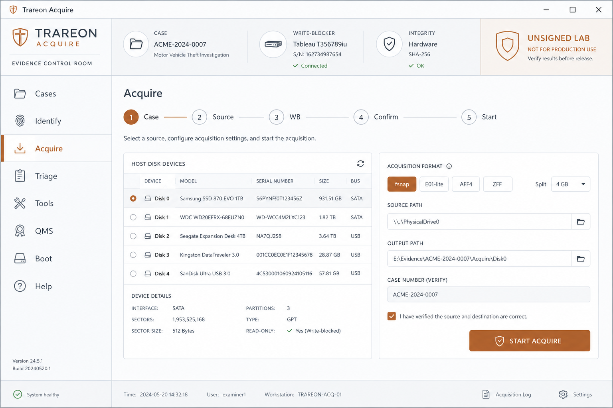
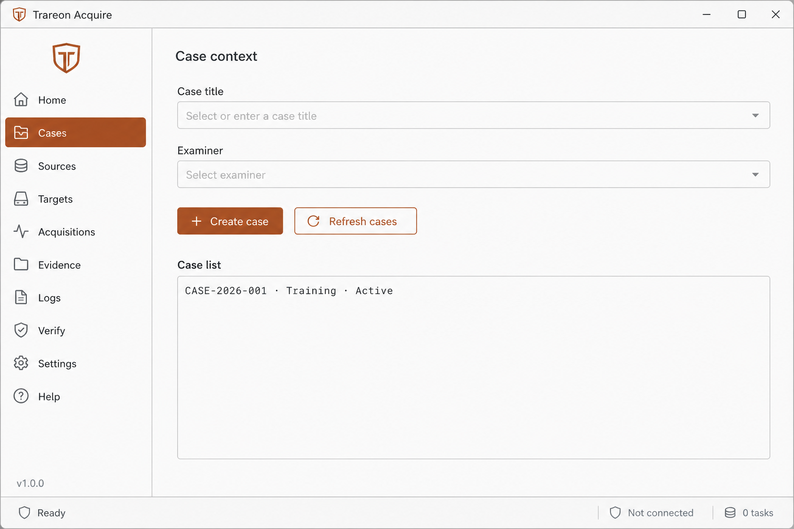
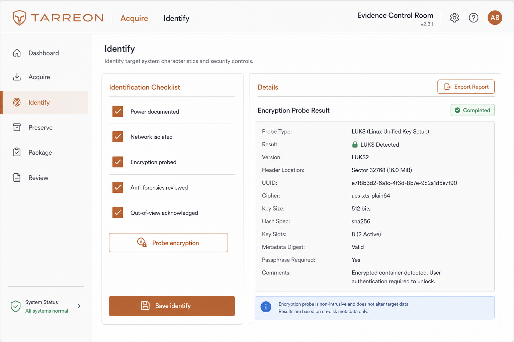
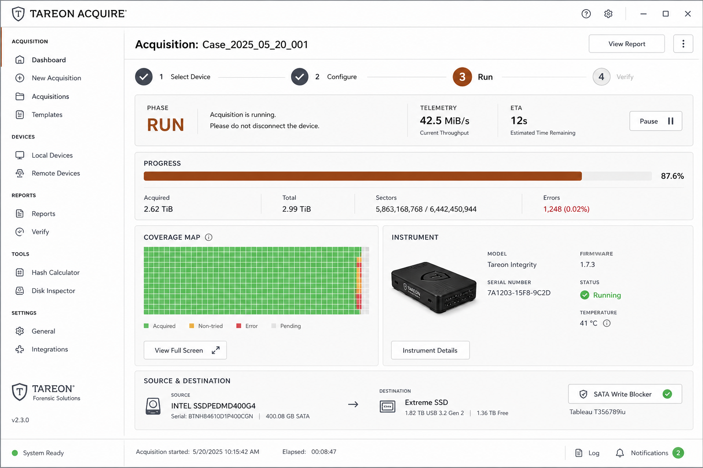
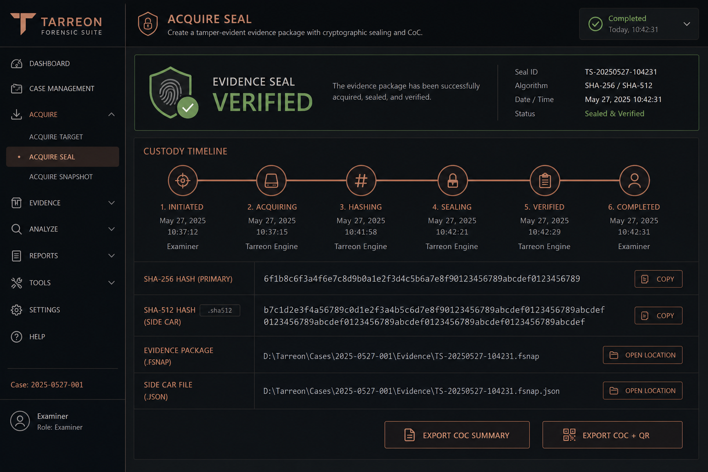
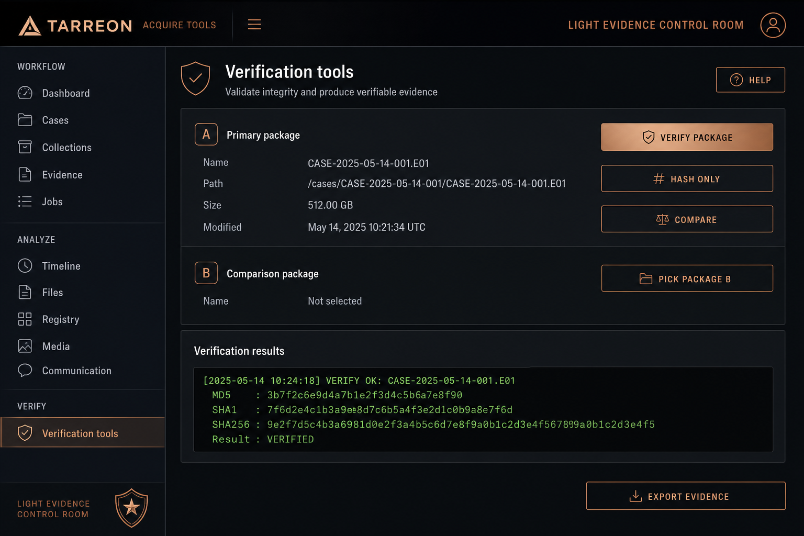
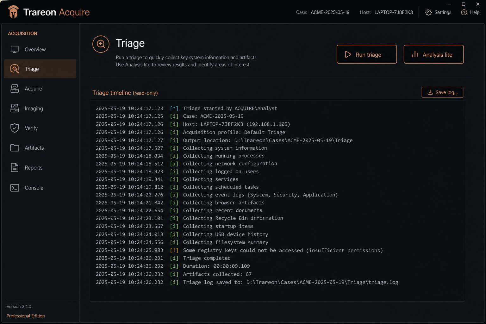
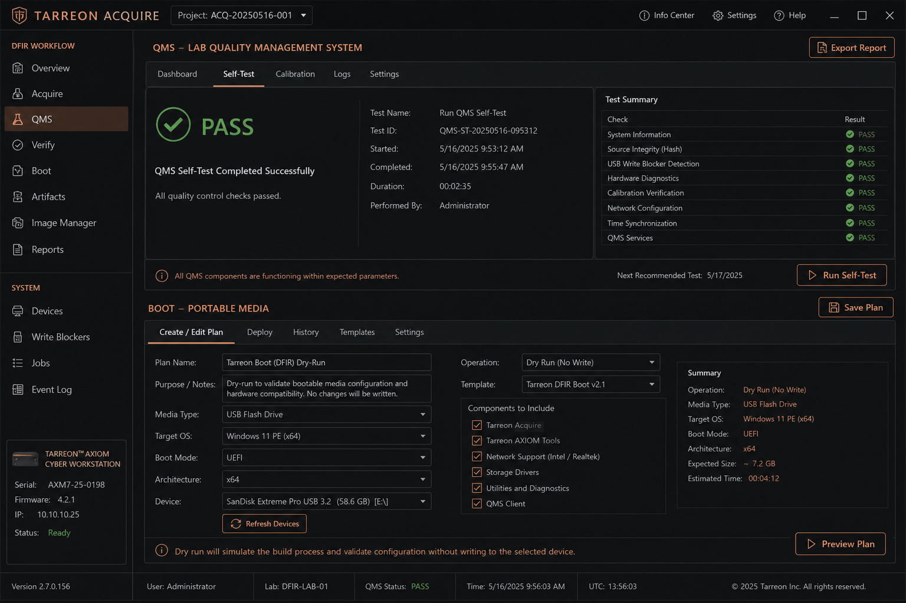
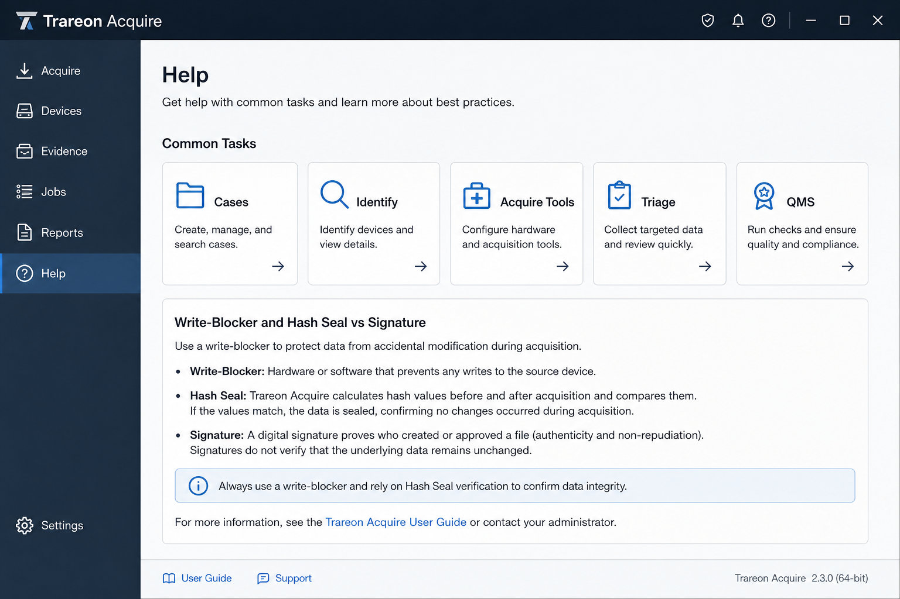

# Trareon Acquire — Operator tutorial

Complete walkthrough of the Slint desktop app. Result class: **Engineering Alpha — Lab Use Only**. Builds are **UNSIGNED**.

Screenshots: [`docs/media/screenshots/`](../media/screenshots/).

---

## 0. Install and launch

1. Install [rustup](https://rustup.rs/). This repo pins **Rust 1.96** via `rust-toolchain.toml`.
2. On macOS, put rustup first: `export PATH="$HOME/.cargo/bin:$PATH"`.
3. Clone and test:

```bash
git clone https://github.com/Trareon-com/Trareon-Acquire.git
cd Trareon-Acquire
cargo test --workspace --locked --exclude acquire-slint
cargo test -p acquire-slint --features gui --locked
```

4. Launch:

```bash
cargo run -p acquire-slint --features gui
```

5. Confirm the **UNSIGNED** / lab banner is visible before any run.



---

## 1. Cases — start custody

Nav: **Cases**

1. Enter **Case title** and **Examiner** (case identity).
2. Click **Create case** — note the generated `CASE-…` id in the panel.
3. Click **Refresh cases** to list stored cases.
4. The case id appears in the instrument strip (**Case** chip).



Orphan acquire (Standard/Expert without a case) is rejected — create a case first outside Guided demo.

---

## 2. Identify — know the source (ISO)

Nav: **Identify**

1. Open with the active case id set.
2. Complete the checklist: power, network, encryption, anti-forensics, out-of-view (OoV).
3. Optionally **Probe encryption** against the Acquire source path.
4. **Save identify** — record is stored beside the case; live acquire stays blocked until checklist + OoV are complete.



---

## 3. Acquire — prepare

Nav: **Acquire**

### Mode

| Mode | Use when |
|---|---|
| Guided | Training — **Load synthetic demo** fills paths |
| Standard | Browse real file paths (still confirm synthetic/training unless lab policy says otherwise) |
| Expert | Raw-path warnings; allowlist / write-blocker discipline |

### Wizard strip

Follow **Case → Source → Write-blocker → Confirm → Start**. Only one primary CTA is active at a time.

### Source

1. **Refresh disks** — host enumerator (incl. Windows `\\.\PhysicalDriveN` when available).
2. **Use first disk path as source**, or Browse a file.
3. Set **Source kind**: Disk / File / RAM / Snapshot  
   - RAM/Snapshot show honest **Unavailable** until `avml` / `fuji` are on `PATH` (or `TRAREON_AVML` / `TRAREON_FUJI`).

### Format & policy

1. Prefer **fsnap** (Path A candidate).
2. **E01-lite** uses the `ewf-image` writer but stays labeled `-lite` until libewf/Autopsy evidence is filed.
3. Optional: E01, ZFF (needs `zffacquire`), Split-RAW + segment MiB. Advanced profiles are experimental (not applied to the run).
4. Toggle **SHA-512 sidecar**.
5. Choose **bad-sector policy**: skip / retry×3 / fail-closed (recorded for custody).
6. Fill **CoC form** fields (device, media #, seq #, description) for later QR export.
7. Confirm synthetic/training checkbox; for block devices, confirm hardware write-blocker.

---

## 4. Acquire — run

1. Click **Start acquire**.
2. Watch **TELEMETRY**: phase, MiB/s, ETA, progress bar.
3. Watch **COVERAGE MAP**: imaged (green) vs error band.
4. **Cancel** cooperatively stops in-flight work (never invents Verified Complete).



---

## 5. Seal and chain of custody

After success:

1. **EVIDENCE SEAL** shows SHA-256 (and SHA-512 if enabled).
2. Read the **custody timeline**.
3. **Export CoC summary** (JSON beside output).
4. **Export CoC + QR** for `.fsnap` packages (`coc.json`, `qr.png`, sticker HTML).



Independent verify (required):

```bash
cargo run -p trareon-verifier --locked -- verify /path/to/package.fsnap
```

---

## 6. Tools — verify hub

Nav: **Tools**

| Action | Purpose |
|---|---|
| Verify package | Full package + optional signature status |
| Hash only | Size + hash without full verify path |
| Browse / Pick package B | Select packages for compare |
| Compare | Byte-level package compare |
| Export evidence | Extract evidence stream beside output |



---

## 7. Triage & Analysis lite

Nav: **Triage**

1. **Run triage** — writes a read-only bundle/notes path.
2. **Analysis lite** — imports `.fsnap` read-only; shows a short audit timeline (field triage, not Autopsy).



---

## 8. QMS and Boot

Nav: **QMS** — **Run QMS** for self-test + known-dataset summary (lab validation pack).

Nav: **Boot** — set boot image path → **Boot plan (dry-run)** (non-destructive plan + warnings).



---

## 9. Help and preferences

Nav: **Help** — short SOP + deep-links to Cases / Identify / Acquire / Tools / Triage / QMS.

Theme: Light (default) / Dark. Locale: **EN** / **ID**.



---

## 10. Multisource (optional)

On Acquire, set **Source B** and **Run dual-source**. The governor chooses parallel vs sequential and writes `resource-governor.json`.

---

## 11. Format interop (lab)

| Path | When |
|---|---|
| **A — RAW / `.fsnap`** | Default candidate RAW path (external verify pending) — [PATH-A-RAW.md](../format-interop/PATH-A-RAW.md) |
| **B — EWF** | Writer shipped; fill [EVIDENCE.md](../format-interop/EVIDENCE.md) with Autopsy/FTK + `ewfverify` before dropping `-lite` |

```bash
scripts/format-interop-smoke.sh   # e01-lite smoke
scripts/ewf-spike.sh              # optional ewf-image sandbox
```

---

## 12. Live-gate (human)

Software probes (`trareon-ata` lab example, elevation helper resolution) prepare evidence. **Humans** check boxes in [live-gate-checklist.md](../live-gate-checklist.md). AI/automation must not mark those complete.

```bash
cargo run -p trareon-ata --example lab_hpa_dco_probe -- --json /path/to/device
```

---

## Checklist after your first successful demo

- [ ] Synthetic acquire sealed with SHA-256
- [ ] `trareon-verifier verify` passed
- [ ] CoC JSON (and QR if `.fsnap`) exported
- [ ] Identify saved for a non-demo case
- [ ] You did **not** claim production or full E01 without evidence rows
